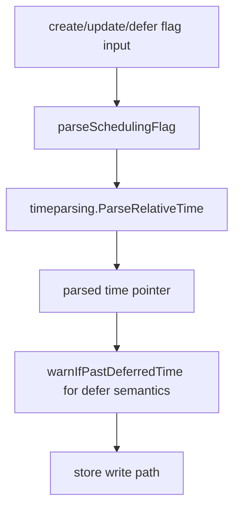
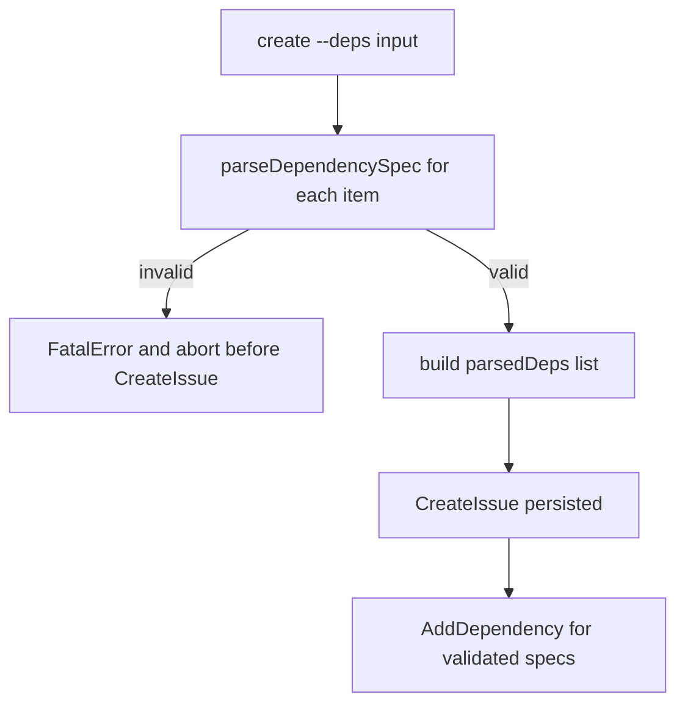
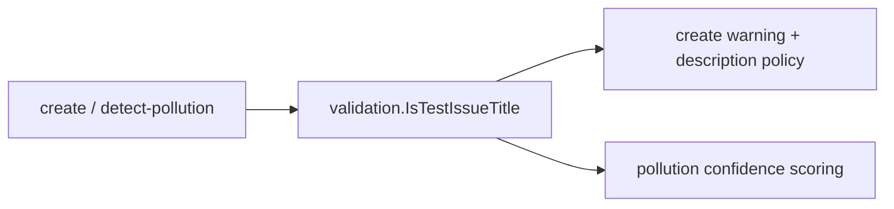

# Architecture Map — Runtime & Flows (Post-Refactor)

This document re-traces the flows modified in Phase 4 and confirms the updated runtime behavior.

## Modified flow set
- Dead-code cleanup in doctor orphaned-issues check (`cmd/bd/doctor/git.go`).
- Logic relocation for test-issue heuristics (`internal/validation/test_issue.go`, call sites in `create` and pollution detection).
- Shared scheduling parse/warn flow (`cmd/bd/scheduling_flags.go`, used by `create`, `update`, `defer`).
- Control-flow hardening for dependency spec parsing in `create` (pre-validation before persistence).

## Re-trace results

### 1) Test-issue heuristic flow (relocated)
Current chain:
1. Entry: `cmd/bd/create.go` and `cmd/bd/detect_pollution.go`.
2. Shared policy: `internal/validation/IsTestIssueTitle`.
3. Behavior:
- `create`: warning/description requirement bypass for obvious test titles.
- `detect-pollution`: high-signal scoring for test prefixes.

Verification evidence:
- Usage trace: `rg -n "IsTestIssueTitle\(" cmd/bd internal/validation`.
- Unit tests: `CGO_ENABLED=0 go test ./internal/validation -count=1`.

No dangling references:
- Old local `isTestIssue` helper removed from command package.

### 2) Scheduling flag parsing flow (unified)
Current chain:
1. Entry flags: `--due`, `--defer`, `--until`.
2. Shared parser: `parseSchedulingFlag` in `cmd/bd/scheduling_flags.go`.
3. Shared warning path: `warnIfPastDeferredTime`.
4. Call sites:
- `cmd/bd/create.go` (direct + cross-rig flows)
- `cmd/bd/update.go`
- `cmd/bd/defer.go`

Verification evidence:
- Usage trace: `rg -n "parseSchedulingFlag\(|warnIfPastDeferredTime\(" ...`.
- Test: `CGO_ENABLED=0 go test ./cmd/bd -run TestParseSchedulingFlag -count=1`.

No dangling references:
- Command files no longer call `timeparsing.ParseRelativeTime` directly for these flags.

### 3) Create dependency control-flow hardening
Current chain:
1. Entry: `--deps` list in `create`.
2. Pre-parse each spec with `parseDependencySpec`.
3. Abort on malformed spec before any issue persistence.
4. Persist issue and apply validated dependencies.

Impact:
- Eliminates silent continuation on malformed dependency specs.
- Prevents partially-configured issue creation when dependency input is invalid.

Verification evidence:
- Compile/test path: `CGO_ENABLED=0 go test ./cmd/bd -run TestCreate -count=1`.
- End-to-end compile smoke: `CGO_ENABLED=0 go test ./cmd/bd -run TestNonExistent -count=1`.

### 4) Doctor orphaned-issues control path cleanup
Current chain:
1. `CheckOrphanedIssues` returns explicit `N/A` for Dolt backend gap.
2. Unreachable legacy SQLite branch removed.

Verification evidence:
- Symbol trace: `rg -n "findOrphanedIssuesFromPath|openDBReadOnly|N/A \(not yet implemented for Dolt backend\)" cmd/bd/doctor/git.go`.
- Test: `CGO_ENABLED=0 go test ./cmd/bd/doctor -run TestCheckOrphanedIssues -count=1`.

No dangling references:
- Removed dead helper functions were not referenced outside deleted block.

## Updated runtime diagrams

### Shared scheduling flow

### Create deps hardened flow

### Test-title policy flow

## Migration notes (breaking behavior)

1. **`bd create --deps` malformed specs now fail fast**
- Previous behavior: malformed specs were warned and skipped; issue could still be created.
- New behavior: malformed specs cause command failure before issue creation.
- Required migration:
- Ensure each dependency is either `id` or `type:id`.
- Ensure `type` is one of: `blocks`, `related`, `parent-child`, `discovered-from`.
- Remove empty targets and malformed commas/segments in scripts.

## Validation run summary
- `CGO_ENABLED=0 go test ./internal/validation -count=1` -> pass
- `CGO_ENABLED=0 go test ./cmd/bd -run 'TestParseSchedulingFlag|TestCheckOrphanedIssues|TestCreate' -count=1` -> pass
- `CGO_ENABLED=0 go test ./cmd/bd/doctor -run TestCheckOrphanedIssues -count=1` -> pass

Note on broader suite:
- Full-package runs in this environment show unrelated baseline failures in pre-existing tests (`cmd/bd`, `cmd/bd/doctor`) outside the modified paths.
