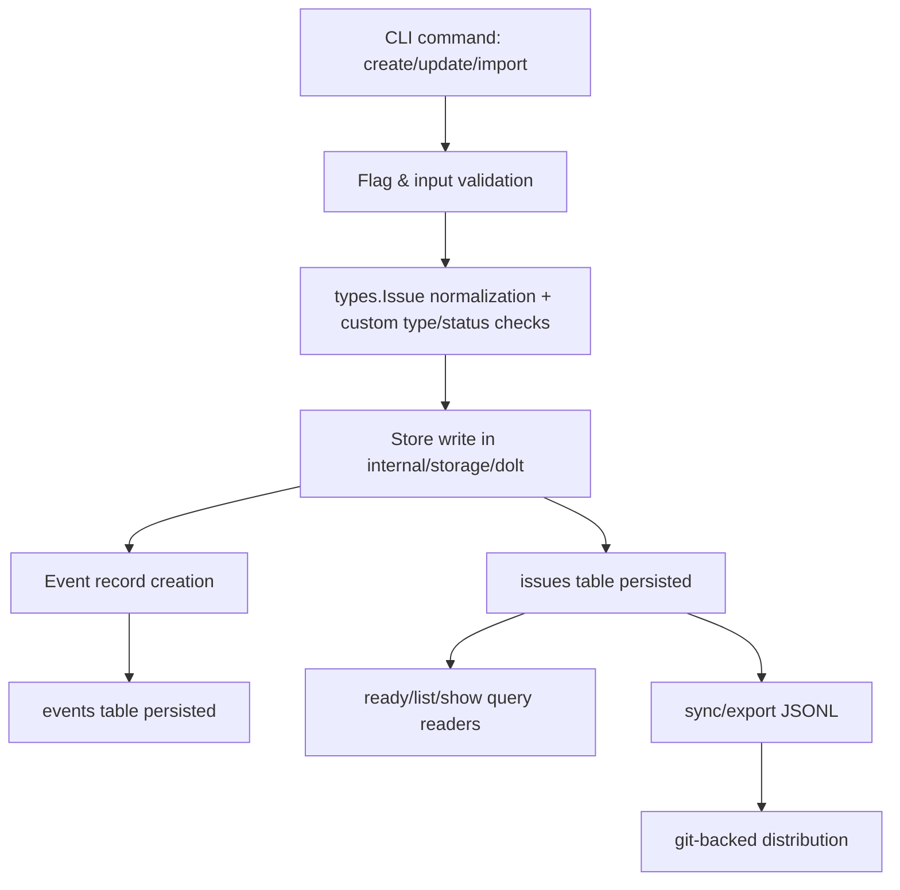
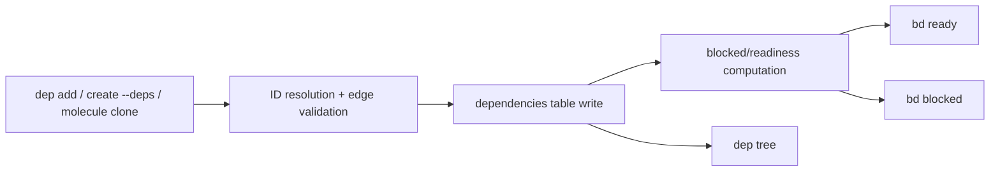
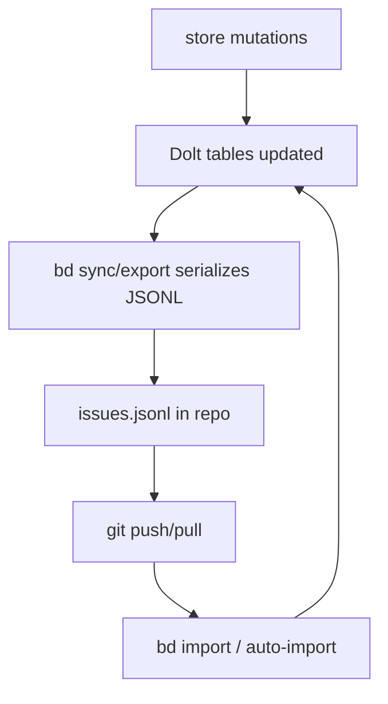
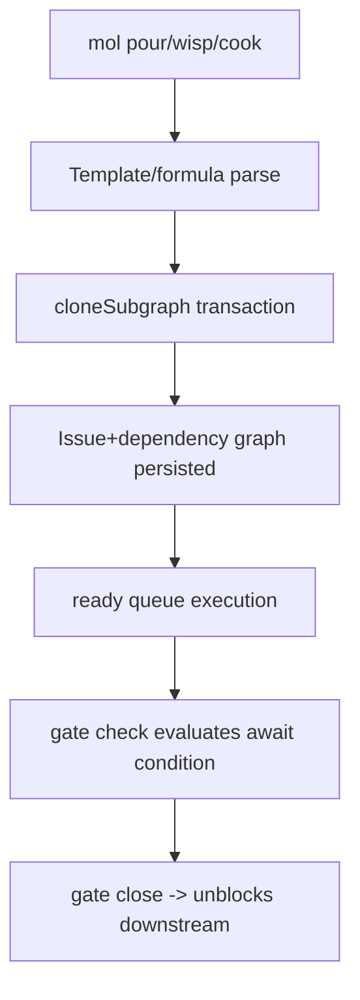

# Architecture Map — Runtime & Flows.

## 2A — Entry Points & Runtime Lifecycle

### Entry point inventory
| Entry point | Trigger | Initialization sequence (ordered) | Shutdown/cleanup | Global state/singletons | Runtime config/env dependencies |
|---|---|---|---|---|---|
| `cmd/bd/main.go` (`bd` CLI) | User runs `bd ...` command | `init()` sets config + command groups + flags -> Cobra command selection -> `PersistentPreRun`: initialize `CommandContext`, reset write trackers, signal context, apply config precedence, enforce env guards, discover/open store, load hooks/templates, set actor and runtime context -> command `Run` | `PersistentPostRun`: optional auto-commit, close store, stop profiling/tracing, cancel root context | Package globals (`store`, `rootCtx`, `hookRunner`, `storeMutex`, write flags, mode flags) | `BD_ACTOR`, `BEADS_ACTOR`, `BEADS_DIR`, `BEADS_DB` (deprecated), `BEADS_WORKING_DIR`, config file values (`dolt.*`, json/readonly flags), CLI flags |
| Subcommand runtime (`cmd/bd/*.go`) | Cobra routes user subcommand | Subcommand `init()` registers command + flags -> inherits global pre-run store/context/hook init -> per-command validation and store operations | Returns to global post-run cleanup | Reuses `store`, `hookRunner`, `CommandContext`, actor/json flags | Command-specific flags plus global config/env |
| `bd doctor --server` (`cmd/bd/doctor_health.go`) | User requests server health diagnostics | Parse target path -> load metadata/config -> connect to Dolt SQL server + run SQL/version/schema checks -> render report | Close SQL connection and exit (non-zero on unhealthy) | Local command structs only | Dolt server host/port/user/password from metadata + `BEADS_DOLT_PASSWORD` override |
| `integrations/beads-mcp/src/beads_mcp/__main__.py` / `beads-mcp` | MCP host (Claude Desktop or MCP client) starts server | Module import sets logging/env compaction defaults -> FastMCP server object created -> tools registered -> request handling resolves workspace context + daemon/CLI client per request | `atexit` + signal handlers call cleanup to close daemon clients | `_daemon_clients`, `_workspace_context`, FastMCP instance | `BEADS_PATH`, `BEADS_DIR`, `BEADS_DB` (deprecated), `BEADS_WORKING_DIR`, `BEADS_USE_DAEMON`, compaction env vars |
| `npm-package/bin/bd.js` | User runs `bd` via npm-installed wrapper | Wrapper resolves packaged native binary and `spawn`s it with passthrough args/stdin/stdout | Child exit code propagated | No long-lived singleton; binary path resolved at runtime | Node runtime + downloaded native binary from postinstall |
| `npm-package/scripts/postinstall.js` | `npm install @beads/bd` | Detect OS/arch -> download matching release artifact -> extract -> chmod -> verify with `bd version` | Process exits after install/verify | None beyond install state | npm env (`CI` behavior), network access to GitHub release artifacts |

### Runtime lifecycle notes
- Initialization side effects are concentrated in `cmd/bd/main.go` and are command-global; this gives consistent behavior but creates high coupling around package globals.
- Hook execution (`internal/hooks`) is invoked from command paths (`create`, `update`, `close`) after persistence actions.
- Global state exists by design in CLI runtime; it is synchronized with `CommandContext` for transition away from legacy globals.

---

## 2B — Data Flows

### Major entity flows
| Entity | Origin | Transformations (ordered) | Handoffs | Persistence | Output | Validation vs trust |
|---|---|---|---|---|---|---|
| `Issue` | CLI args/flags (`create`, `update`, molecules) or JSONL import | Flag parse -> normalize type/priority -> `types.Issue` construction -> `Issue.ValidateWithCustom` -> content hash + store create/update -> event generation -> export serialization | `cmd/bd/*` -> `internal/validation` -> `internal/types` -> `internal/storage/dolt` -> export/sync | `issues` table (Dolt), mirrored to `.beads/issues.jsonl` on sync/export | CLI JSON/human output, `ready/list/show`, exported JSONL, downstream integrations | Validated at command+store boundaries; trusted after DB constraints and store-level checks |
| `Dependency` | `bd dep add`, create-time `--deps`, template/molecule cloning | ID resolution/routing -> dependency type parse -> cycle and anti-pattern checks -> add/update dep rows -> blocked cache updates/readiness impact | `cmd/bd/dep` + create/template flows -> `internal/storage/dolt/dependencies` -> query layer | `dependencies` table + blocked/readiness computed state | `dep tree`, `ready`, `blocked`, JSON export | Validated for known IDs/cycle checks for blocking edges; external refs partially trusted until runtime resolution |
| `Label` | `bd label add/remove`, create/update label flags | Parse/set operations -> reserved namespace checks -> add/remove label rows -> event record | `cmd/bd/label` / `cmd/bd/update` -> store layer | `labels` table (+ events) | label list/filter views and JSON export | Validated in command/store; trusted after FK/unique constraints |
| `Comment` | `bd comments add` inputs (arg/file) | Resolve issue -> parse comment payload -> insert comment row -> include in export | `cmd/bd/comments` -> store layer | `comments` table | comments/show/export | Minimal structural validation + DB constraints |
| `Event` | Side effects of create/update/close/label/dep operations | Mutation action -> `recordEvent` with actor/transition payload -> exportable audit stream | Store mutation methods -> events reader/export | `events` table | `show/history` style outputs + JSON export | Mostly trusted from store-generated metadata |
| Molecule/Wisp/Gate metadata | `bd mol*`, `bd gate*`, template/formula expansion | Template parse -> variable resolution -> clone issue subgraph + deps -> set workflow fields (`Await*`, `Ephemeral`, `WispType`) -> gate checks/close | `cmd/bd/mol*` / `cmd/bd/gate` -> template helpers -> store | Same core issue/dependency tables with workflow fields | ready/blocked/gate check outputs, wisp operations, export (wisps excluded) | Validated by template parser + command checks; gate external conditions are runtime-trusted signals |

### Flow diagram — Issue lifecycle

### Flow diagram — Dependency/readiness path

### Flow diagram — Sync/export/import path

### Flow diagram — Molecule/Gate runtime path

---

## 2C — Control Flow & Call Chains

### Operation: Create issue
Call chain:
1. `cmd/bd/create.go` parses flags and validates command constraints.
2. Builds `types.Issue` and calls `store.CreateIssue`.
3. Adds labels/deps/parent-child edges and optional waits-for/gate links.
4. Runs hooks and emits output.

- Sync/async boundaries: synchronous write path; hook execution occurs in-process post-write.
- Error handling: fatal on required validation/store failures, warn-and-continue on some optional post-create adornments.
- Branching: cross-rig creation, dry-run mode, explicit ID, event/agent/molecule variants.
- Deep chain (>4): yes (`create -> store -> validation -> event -> dep/label/hook`).
- Hidden side effects: auto events, hook invocation, last-touched ID updates.

### Operation: Claim/update issue
Call chain:
1. `cmd/bd/update.go` resolves IDs/routing and parses mutation flags.
2. Optional CAS claim via `ClaimIssue`.
3. Applies field updates + label mutations + parent/dependency changes.
4. Runs update hooks and returns refreshed issue.

- Sync/async: synchronous path.
- Error handling: per-issue errors reported; loop continues for multi-ID updates.
- Branching: claim-only vs update; metadata parsing from inline JSON or file.
- Risk point: partial multi-step mutation behavior if one post-claim operation fails.

### Operation: Close issue
Call chain:
1. `cmd/bd/close.go` resolves issue(s) and checks blockers/gate conditions.
2. Calls `store.CloseIssue` (status transition + event record).
3. Runs close hooks.
4. Computes newly unblocked issues and optionally advances molecule step.

- Sync/async: synchronous closure path.
- Branching: forced close bypass, routed close, molecule auto-advance.
- Hidden ordering dependency: close reason semantics affect `conditional-blocks` behavior.

### Operation: Ready query
Call chain:
1. `cmd/bd/ready.go` builds `types.WorkFilter`.
2. Calls `store.GetReadyWork`.
3. Store query excludes blocked/deferred/workflow-ineligible items.
4. Output renderer prints or returns JSON.

- Sync/async: read-only synchronous path.
- Branching: scope filters (`parent`, `label`, `unassigned`, `--mol`, gated mode).
- Implicit ordering requirement: correctness relies on up-to-date dependency + status states.

### Operation: Dependency add
Call chain:
1. `cmd/bd/dep.go` parses type and resolves IDs (including external refs).
2. `store.AddDependency` validates endpoints and blocking-cycle safety.
3. Writes dependency edge and reports result.

- Sync/async: synchronous.
- Branching: dep type-specific checks; direction flags for tree visualization.
- Hidden side effect: dependency insertion changes ready/blocked queue behavior immediately.

### Operation: Sync/export/import
Call chain:
1. `sync/export` reads full data set from store.
2. Serializes to canonical JSONL order and writes atomically.
3. Optional git/sync-branch interactions handle sharing.
4. `import` parses JSONL, resolves collisions/remaps, writes store rows.

- Sync/async: synchronous command, distributed effects through git.
- Error paths: explicit failure on malformed/merge-marker JSONL, prefix collisions, incompatible import state.
- Retry logic: storage layer retry/backoff exists in Dolt operations.

### Operation: Molecule workflows
Call chain:
1. `cmd/bd/mol*` resolves proto/formula/template.
2. `cloneSubgraph` creates issue graph in transaction.
3. Dependency graph drives execution through normal `ready` loop.
4. Gate checks close gate issues and unlock dependents.

- Sync/async boundaries: graph creation is sync; execution lifecycle can span sessions/agents.
- Branching: persistent molecule vs ephemeral wisp, bond types, squash/burn behavior.
- Hidden ordering requirement: template dependency shape must be valid or execution stalls.

### Control-flow risk flags
- Deep call chains exist in create/update/close/mol orchestration paths.
- No hard circular package dependency found, but runtime cycles can be created at dependency-graph level if checks are bypassed.
- Close reason strings have semantic side effects on conditional fallback logic.

---

## 2D — Logic Placement Audit

| Current logic location | Should live in | Evidence of issue | Duplication | Tangled with infra/framework |
|---|---|---|---|---|
| `cmd/bd/create.go` description/test-title checks and issue-type flag coupling | `internal/validation` policy helpers | Business rule sits in CLI parse flow, so alternate entry points must replicate it | Partial (other commands enforce adjacent rules differently) | Yes (mixed with Cobra/CLI rendering and routing) |
| `cmd/bd/create.go`, `cmd/bd/update.go`, `cmd/bd/defer.go` time scheduling parse/warn logic | Shared scheduling helper (`internal/timeparsing` + thin CLI adapter) | Same parse+error+past-date semantics repeated in multiple commands | Yes | Yes |
| `cmd/bd/detect_pollution.go` test-issue heuristic reused by create warnings | Shared validation/pollution package | Heuristic exists in deprecated command file but is consumed by active create flow | Yes (pattern use is split) | Yes |
| Close reason safety knowledge spread across docs/procedure and command usage patterns | Central lint helper in command layer | Close reason affects dependency behavior; policy currently procedural | Partial | Yes |
| `cmd/bd/main.go` retains broad mutable globals while transitioning to `CommandContext` | Complete context object ownership with minimal globals | High-coupling initialization with many side effects and shared mutable state | N/A | Yes |

### Corroborating external signal
Issue `#1552` and follow-up comments highlight the same class of problems: agent control-flow ambiguity, lifecycle-vs-execution mixing, WIP discipline gaps, and close-reason/load-bearing semantics. This aligns with the runtime/control-flow evidence above.
