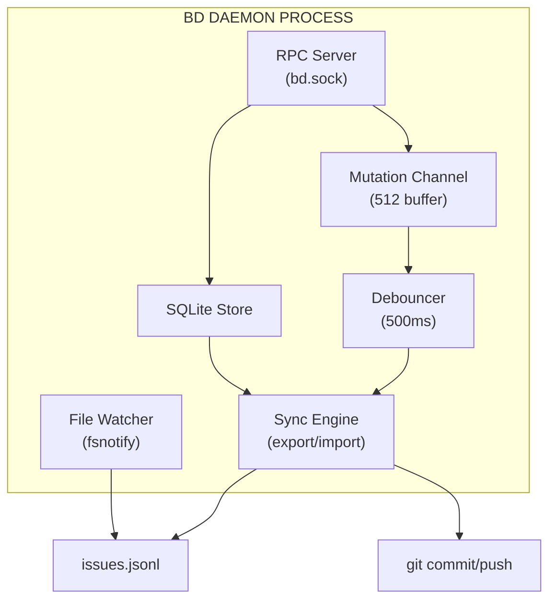
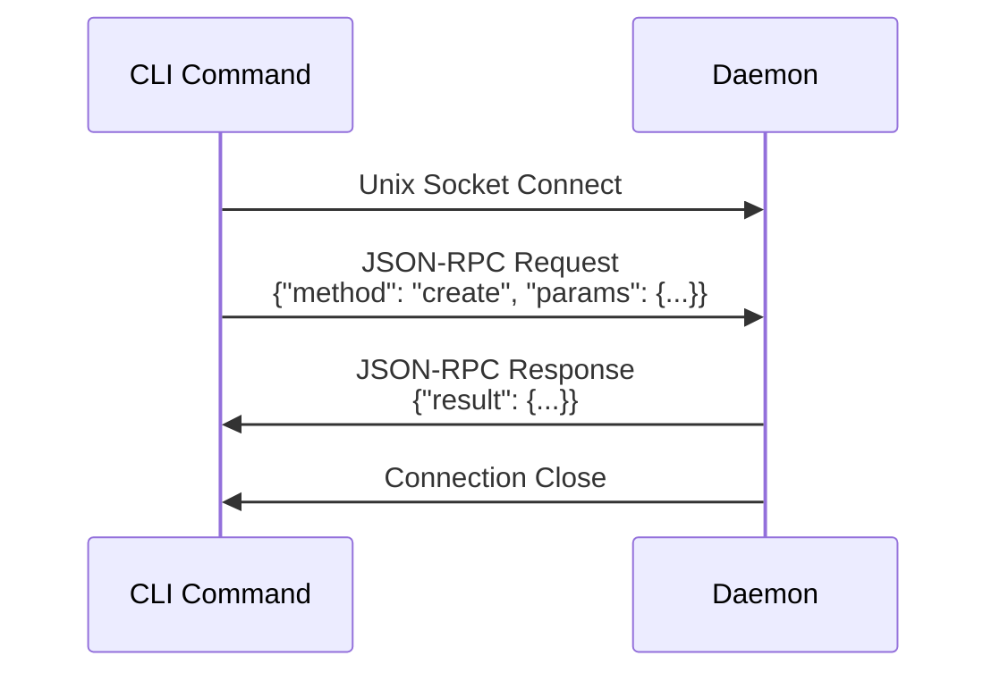

# Beads Daemon: Technical Analysis and Architectural Guide

A comprehensive analysis of the beads daemon implementation, with learnings applicable to other projects implementing similar background process patterns.

> Legacy: The daemon/RPC layer has been removed from current releases. This document is historical.

---

## Table of Contents

1. [Overview](#overview)
2. [Goals and Purpose](#goals-and-purpose)
3. [Architecture Deep Dive](#architecture-deep-dive)
4. [Memory Analysis](#memory-analysis-why-30-35mb)
5. [Platform Support](#platform-support-comparison)
6. [Historical Problems and Fixes](#historical-problems-and-fixes)
7. [Daemon Without Database Analysis](#daemon-without-database-analysis)
8. [Architectural Guidance for Other Projects](#architectural-guidance-for-other-projects)
9. [Technical Design Patterns](#technical-design-patterns)
10. [Proposed Improvements (Expert-Reviewed)](#proposed-improvements-expert-reviewed)
11. [Configuration Reference](#configuration-reference)
12. [Key Contributors](#key-contributors)
13. [Conclusion](#conclusion)

---

## Overview

The `bd daemon` is a background process that provides automatic synchronization between the local SQLite database and the git-tracked JSONL file. It follows an **LSP-style model** with one daemon per workspace, communicating via Unix domain sockets (or named pipes on Windows).

**Key insight:** The daemon exists primarily to automate a single operation - `bd export` before git commits. Everything else is secondary.

---

## Goals and Purpose

### Primary Goals

| Goal | How Daemon Achieves It | Value |
|------|------------------------|-------|
| **Data safety** | Auto-exports changes to JSONL (500ms debounce) | Users don't lose work if they forget `bd sync` |
| **Multi-agent coordination** | Single point of database access via RPC | Prevents SQLite locking conflicts |
| **Team collaboration** | Auto-commit/push in background | Changes reach remote without manual intervention |

### Secondary Goals

| Goal | How Daemon Achieves It | Value |
|------|------------------------|-------|
| **Performance** | Holds DB connection open, batches operations | Faster subsequent queries |
| **Real-time monitoring** | Enables `bd watch` and status updates | Live feedback on issue state |
| **Version management** | Auto-detects version mismatches | Prevents incompatible daemon/CLI combinations |

### What the Daemon is NOT For

- **Not a system monitor** - Don't add disk space, CPU, or general health monitoring
- **Not a task scheduler** - Don't add cron-like job scheduling
- **Not a server** - It's a local process, not meant for remote access

---

## Architecture Deep Dive

### Component Diagram



### Key Files

| Component | File Path | Purpose |
|-----------|-----------|---------|
| CLI entry | `cmd/bd/daemon.go` | Command definition, flag handling |
| Lifecycle | `cmd/bd/daemon_lifecycle.go` | Startup, shutdown, graceful termination |
| Event loop | `cmd/bd/daemon_event_loop.go` | Main loop, ticker coordination |
| File watcher | `cmd/bd/daemon_watcher.go` | fsnotify integration |
| Debouncer | `cmd/bd/daemon_debouncer.go` | Event batching |
| Sync engine | `cmd/bd/daemon_sync.go` | Export, import, git operations |
| Auto-start | `cmd/bd/daemon_autostart.go` | Version checks, restart logic |
| RPC server | `internal/rpc/server_core.go` | Connection handling, protocol |
| Unix impl | `cmd/bd/daemon_unix.go` | Signal handling, flock |
| Windows impl | `cmd/bd/daemon_windows.go` | Named pipes, process management |

### Communication Protocol



### Event-Driven vs Polling Mode

| Mode | Trigger | Latency | CPU Usage | Default Since |
|------|---------|---------|-----------|---------------|
| **Events** | fsnotify + RPC mutations | <500ms | ~0.5% idle | v0.21.0 |
| **Polling** | 5-second ticker | ~5000ms | ~2-3% continuous | v0.1.0 |

**Event mode flow:**
1. RPC mutation received -> pushed to mutation channel
2. Mutation listener picks up event -> triggers debouncer
3. After 500ms quiet period -> export to JSONL
4. If auto-commit enabled -> git commit
5. If auto-push enabled -> git push

---

## Memory Analysis: Why 30-35MB?

### Memory Breakdown

| Component | Memory | Notes |
|-----------|--------|-------|
| **SQLite connection pool** | 12-20 MB | `NumCPU + 1` connections, WASM runtime |
| **WASM runtime (wazero)** | 5-10 MB | JIT-compiled SQLite, cached on disk |
| **Go runtime** | 5-8 MB | GC, scheduler, runtime structures |
| **RPC buffers** | 0.4-12.8 MB | 128KB per active connection |
| **Mutation channel** | ~200 KB | 512-event buffer, 300-400 bytes each |
| **File watcher** | ~10 KB | 4 watched paths |
| **Goroutine stacks** | ~220 KB | ~110 goroutines x 2KB each |

### Why SQLite Uses So Much Memory

The beads daemon uses `ncruces/go-sqlite3`, which embeds SQLite as **WebAssembly** via the wazero runtime. This has tradeoffs:

**Pros:**
- No CGO required - pure Go, cross-compiles easily
- Works on all platforms including WASM
- First startup compiles to native code (~220ms), then cached (~20ms subsequent)

**Cons:**
- Higher baseline memory than CGO-based sqlite drivers
- Per-connection overhead includes WASM instance state
- Connection pool multiplies the overhead

### Memory by Connection Count

| Connections | Expected Memory | Use Case |
|-------------|-----------------|----------|
| 1 (idle) | ~15-20 MB | Local single-user |
| 3 (typical) | ~20-25 MB | Agent workflows |
| 10 | ~25-30 MB | Multi-agent parallel |
| 100 (max) | ~40-50 MB | Stress testing |

### Is 30-35MB Reasonable?

**Yes.** For context:
- VS Code language servers: 50-200+ MB each
- Node.js process: ~30-50 MB baseline
- Typical Go HTTP server: ~20-40 MB
- Docker daemon: ~50-100 MB

The beads daemon is **efficient for what it does**. The memory is dominated by SQLite, which provides actual value (query performance, connection pooling).

### Memory Optimization Options

If memory is a concern:

```bash
# Reduce max connections (default: 100)
export BEADS_DAEMON_MAX_CONNS=10

# Use direct mode (no daemon)
export BEADS_NO_DAEMON=true
```

---

## Platform Support Comparison

| Platform | Status | Implementation | Known Issues |
|----------|--------|----------------|--------------|
| **macOS** | Full support | FSEvents via kqueue | Path casing mismatches (fixed GH#880) |
| **Linux** | Full support | inotify | Resource limits (`ulimit -n`) |
| **Windows** | Partial | Named pipes, `ReadDirectoryChangesW` | MCP server falls back to direct mode |
| **WSL** | Limited | Reduced fsnotify reliability | Recommend polling mode |
| **WASM** | None | No-op stubs | Daemon operations not supported |

### Windows Limitations

Windows has more limited daemon support due to:

1. **No Unix domain sockets** - Uses named pipes instead, which have different semantics
2. **Python asyncio incompatibility** - MCP server cannot use `asyncio.open_unix_connection()`
3. **Graceful fallback** - Windows automatically uses direct CLI mode (GH#387)

### Platform-Specific Implementation Files

```
cmd/bd/daemon_unix.go      # Linux, macOS, BSD - signals, flock
cmd/bd/daemon_windows.go   # Windows - named pipes, process groups
cmd/bd/daemon_wasm.go      # WASM - no-op stubs
```

---

## Historical Problems and Fixes

### Critical Issues Resolved

| Issue | Root Cause | Fix | Commit |
|-------|------------|-----|--------|
| **Startup timeout >5s** (GH#863) | Legacy database without repo fingerprint validation | Propagate actual error to user instead of generic timeout | `2f96795f` |
| **Path casing mismatch** (GH#880) | macOS case-insensitive paths vs case-sensitive string comparison | Use `utils.PathsEqual()` for all path comparisons | `b789b995`, `7b90678a`, `a1079fcb` |
| **Stale daemon.lock delays** | PID reuse after crash - waiting for socket that never appears | Use flock-based liveness check instead of PID | `21de4353` |
| **Event storms** (GH#883) | Empty `gitRefsPath` triggering infinite loops | Guard against empty paths before watching | `b3d64d47` |
| **Commands failing in daemon mode** (GH#719, GH#751) | Commands accessing nil store directly | Add direct-store fallback pattern | `bd6fa5cb`, `78b81341` |
| **Sync branch divergence** (GH#697) | Push failures on diverged branches | Fetch-rebase-retry pattern | `ee016bbb` |
| **Missing tombstones** (GH#696) | Deletions not propagating to other clones | Include tombstones in export | `82cbd98e` |

### Learnings from Each Bug Class

#### 1. Dual-Mode Command Support

**Problem:** Commands like `bd graph`, `bd create -f` worked in direct mode but crashed in daemon mode.

**Root cause:** Code accessed `store` global variable, which is `nil` when daemon is running.

**Pattern fix:**
```go
// BAD - crashes in daemon mode
func myCommand() {
    result := store.Query(...)  // store is nil
}

// GOOD - works in both modes
func myCommand() {
    if store == nil {
        // Initialize direct store as fallback
        store, _ = sqlite.Open(dbPath)
        defer store.Close()
    }
    result := store.Query(...)
}
```

**Prevention:** Every new command must be tested in both daemon and direct mode.

#### 2. Path Normalization on Case-Insensitive Filesystems

**Problem:** macOS treats `/Users/Bob/MyProject` and `/users/bob/myproject` as the same path, but Go's `==` doesn't.

**Pattern fix:**
```go
// BAD - fails on macOS
if path1 == path2 { ... }

// GOOD - handles case-insensitive filesystems
if utils.PathsEqual(path1, path2) { ... }
```

**Implementation of PathsEqual:**
```go
func PathsEqual(a, b string) bool {
    if runtime.GOOS == "darwin" || runtime.GOOS == "windows" {
        return strings.EqualFold(filepath.Clean(a), filepath.Clean(b))
    }
    return filepath.Clean(a) == filepath.Clean(b)
}
```

#### 3. Process Liveness Detection

**Problem:** Checking if PID exists doesn't work reliably - PIDs get reused after crashes.

**Pattern fix:**
```go
// BAD - PIDs get reused
if processExists(pid) { /* daemon is alive */ }

// GOOD - file locks released on process death
if isLockHeld(lockFile) { /* daemon is alive */ }
```

**Key insight:** The operating system releases file locks when a process dies, even if it crashes. This is immune to PID reuse.

#### 4. Debouncing File Events

**Problem:** File watcher fires multiple events for single operation, causing event storms.

**Pattern fix:**
```go
type Debouncer struct {
    timer    *time.Timer
    duration time.Duration
    action   func()
    mu       sync.Mutex
}

func (d *Debouncer) Trigger() {
    d.mu.Lock()
    defer d.mu.Unlock()

    if d.timer != nil {
        d.timer.Stop()
    }
    d.timer = time.AfterFunc(d.duration, d.action)
}
```

**Beads uses:** 500ms debounce window, which batches rapid file changes into single sync operations.

---

## Daemon Without Database Analysis

### The Question

> Is a daemon useful WITHOUT a database, just for managing async tasks and keeping the main CLI event loop free?

### Analysis

The beads daemon's primary value is **auto-sync to JSONL** (avoiding manual `bd export` before commits). Without a database, this use case disappears.

| Use Case | Value Without DB | Reasoning |
|----------|------------------|-----------|
| File watching & debouncing | **Low** | CLI is source of truth, not files on disk |
| Background git operations | **Low** | Git commands are fast (milliseconds); async adds complexity without UX benefit |
| Health monitoring | **Low** | What would you monitor? This is scope creep |
| RPC coordination | **Low** | Beads is single-user by design; no shared state needed |

### When to Use a Daemon (General Guidance)

**Use a daemon when you have:**
- Long-running background work (indexing, compilation, sync)
- Shared state across processes (LSP servers, database connections)
- Event-driven updates that need immediate response
- Resource pooling that amortizes expensive operations

**Avoid daemons when:**
- Commands complete in milliseconds
- No shared state between invocations
- Synchronous feedback is expected
- Complexity exceeds benefit

### Verdict for Beads

**The daemon should ONLY exist when using SQLite storage for auto-sync.**

Without a database:
- No sync needed (git is the only source)
- No long-running queries to optimize
- No connection pooling benefits
- No async operations that improve UX

**Recommendation:** Document that daemon mode requires SQLite and serves ONLY to automate `bd export`. Don't expand daemon scope beyond this clear purpose.

---

## Architectural Guidance for Other Projects

If you're implementing a similar daemon pattern, here are the key learnings from beads:

### 1. Design Principles

| Principle | Description |
|-----------|-------------|
| **Single Responsibility** | One daemon, one job (beads: auto-sync). Resist scope creep. |
| **Graceful Degradation** | Always have a direct mode fallback. CLI should work without daemon. |
| **Transparent Operation** | Daemon should be invisible when working. Only surface errors when user needs to act. |
| **Robust Lifecycle** | Use file locks, not PIDs, for liveness. Handle crashes, version mismatches, stale state. |
| **Platform Awareness** | Abstract platform differences early. Test on all target platforms. |

### 2. Essential Components

Every daemon needs these components:

| Component | Purpose | Beads Implementation |
|-----------|---------|----------------------|
| **IPC mechanism** | CLI-to-daemon communication | Unix sockets, named pipes |
| **Liveness detection** | Is daemon running? | File locks (not PIDs) |
| **Version checking** | Prevent mismatches | Compare versions on connect |
| **Graceful shutdown** | Clean termination | Signal handlers + timeout |
| **Auto-restart** | Recovery from crashes | On connect, check version |
| **Logging** | Debugging | Structured logs with rotation |
| **Health checks** | Self-diagnosis | Periodic integrity checks |

### 3. IPC Protocol Design

**Keep it simple:**
```json
// Request
{"method": "create", "params": {"title": "Bug fix"}, "id": 1}

// Response
{"result": {"id": "bd-abc123"}, "id": 1}

// Error
{"error": {"code": -1, "message": "Not found"}, "id": 1}
```

**Recommendations:**
- Use JSON-RPC or similar simple protocol
- Include request IDs for correlation
- Keep messages small (don't stream large data)
- Set reasonable timeouts (beads: 30s default)

### 4. File Lock Pattern

```go
// Recommended: flock-based liveness check
func isDaemonAlive(lockPath string) bool {
    f, err := os.OpenFile(lockPath, os.O_RDONLY, 0644)
    if err != nil {
        return false  // Lock file doesn't exist
    }
    defer f.Close()

    // Try to acquire exclusive lock (non-blocking)
    err = syscall.Flock(int(f.Fd()), syscall.LOCK_EX|syscall.LOCK_NB)
    if err != nil {
        return true   // Lock held by daemon - it's alive
    }

    // We got the lock, meaning daemon is dead
    syscall.Flock(int(f.Fd()), syscall.LOCK_UN)
    return false
}
```

### 5. Event Debouncing Pattern

```go
// Generic debouncer - prevents event storms
type Debouncer struct {
    mu       sync.Mutex
    timer    *time.Timer
    duration time.Duration
    callback func()
}

func NewDebouncer(d time.Duration, cb func()) *Debouncer {
    return &Debouncer{duration: d, callback: cb}
}

func (d *Debouncer) Trigger() {
    d.mu.Lock()
    defer d.mu.Unlock()

    if d.timer != nil {
        d.timer.Stop()
    }
    d.timer = time.AfterFunc(d.duration, func() {
        d.mu.Lock()
        d.timer = nil
        d.mu.Unlock()
        d.callback()
    })
}
```

### 6. Dual-Mode Command Pattern

```go
// Ensure all commands work in both daemon and direct mode
func runCommand(ctx context.Context) error {
    // Try daemon first
    if daemonClient := tryConnectDaemon(); daemonClient != nil {
        return runViaDaemon(ctx, daemonClient)
    }

    // Fall back to direct mode
    store, err := openDatabase()
    if err != nil {
        return err
    }
    defer store.Close()

    return runDirect(ctx, store)
}
```

### 7. Platform Abstraction

```go
// daemon_unix.go
//go:build unix

func acquireLock(path string) (*os.File, error) {
    f, err := os.OpenFile(path, os.O_CREATE|os.O_RDWR, 0644)
    if err != nil {
        return nil, err
    }
    err = unix.Flock(int(f.Fd()), unix.LOCK_EX|unix.LOCK_NB)
    if err != nil {
        f.Close()
        return nil, err
    }
    return f, nil
}

// daemon_windows.go
//go:build windows

func acquireLock(path string) (*os.File, error) {
    f, err := os.OpenFile(path, os.O_CREATE|os.O_RDWR, 0644)
    if err != nil {
        return nil, err
    }
    err = windows.LockFileEx(
        windows.Handle(f.Fd()),
        windows.LOCKFILE_EXCLUSIVE_LOCK|windows.LOCKFILE_FAIL_IMMEDIATELY,
        0, 1, 0, &windows.Overlapped{},
    )
    if err != nil {
        f.Close()
        return nil, err
    }
    return f, nil
}
```

---

## Technical Design Patterns

### Pattern 1: Mutation Channel with Dropped Event Detection

```go
type Server struct {
    mutationChan    chan MutationEvent
    mutationCounter uint64
    droppedCounter  uint64
}

func (s *Server) SendMutation(event MutationEvent) {
    atomic.AddUint64(&s.mutationCounter, 1)

    select {
    case s.mutationChan <- event:
        // Sent successfully
    default:
        // Channel full - record dropped event
        atomic.AddUint64(&s.droppedCounter, 1)
    }
}

// Event loop periodically checks for drops
func (s *Server) checkDroppedEvents() {
    if atomic.LoadUint64(&s.droppedCounter) > 0 {
        // Trigger full sync to recover
        s.triggerFullSync()
        atomic.StoreUint64(&s.droppedCounter, 0)
    }
}
```

### Pattern 2: Exponential Backoff for Sync Failures

```go
type SyncState struct {
    Failures    int       `json:"failures"`
    LastFailure time.Time `json:"last_failure"`
    NextRetry   time.Time `json:"next_retry"`
}

func (s *SyncState) GetBackoffDuration() time.Duration {
    backoffs := []time.Duration{
        30 * time.Second,
        1 * time.Minute,
        2 * time.Minute,
        5 * time.Minute,
        10 * time.Minute,
        30 * time.Minute,  // Max
    }

    idx := s.Failures
    if idx >= len(backoffs) {
        idx = len(backoffs) - 1
    }
    return backoffs[idx]
}
```

### Pattern 3: Global Registry for Multi-Daemon Discovery

```go
// ~/.beads/registry.json
type Registry struct {
    Daemons []DaemonEntry `json:"daemons"`
}

type DaemonEntry struct {
    Workspace  string    `json:"workspace"`
    SocketPath string    `json:"socket_path"`
    PID        int       `json:"pid"`
    Version    string    `json:"version"`
    StartTime  time.Time `json:"start_time"`
}

// O(1) daemon lookup instead of filesystem scan
func FindDaemon(workspace string) (*DaemonEntry, error) {
    registry := loadRegistry()
    for _, d := range registry.Daemons {
        if d.Workspace == workspace {
            return &d, nil
        }
    }
    return nil, ErrNotFound
}
```

---

## Proposed Improvements (Expert-Reviewed)

Each improvement has been reviewed for actual value vs complexity.

### Recommended (High Value, Low-Medium Complexity)

| Improvement | Value | Complexity | Reasoning |
|-------------|-------|------------|-----------|
| **CI matrix tests (Windows/macOS/Linux)** | High | Low | GitHub Actions makes this trivial; catches platform bugs early |
| **Automated daemon vs direct mode tests** | High | Medium | Prevents regressions; ensures feature parity |
| **`bd doctor daemon` subcommand** | Medium | Low | High ROI for debugging; user self-service |

### Deferred (Wait for User Demand)

| Improvement | Value | Complexity | Reasoning |
|-------------|-------|------------|-----------|
| **Per-worktree daemon instances** | Medium | High | Useful for monorepos but adds significant complexity; wait for demand |
| **Document ulimit settings** | Low | Low | Only relevant if users hit limits; document when reported |

### Skip (Over-Engineered)

| Improvement | Value | Complexity | Reasoning |
|-------------|-------|------------|-----------|
| **Windows named pipe support in MCP** | Low | Medium | MCP server (bd-5) isn't implemented yet; premature optimization |
| **Auto-detect NFS/SMB mounts** | Low | High | Over-engineered for rare edge case; let users opt into polling |
| **Prometheus metrics endpoint** | Low | Medium | Overkill for local dev tool; who monitors their local issue tracker? |

### Priority Order for Implementation

1. **CI matrix tests** - Prevents regressions, low effort
2. **Daemon vs direct mode tests** - Ensures correctness
3. **`bd doctor daemon`** - Improves debuggability

**Everything else:** Skip or defer until proven user demand.

---

## Configuration Reference

### config.yaml

```yaml
# .beads/config.yaml
daemon:
  auto-sync: true           # Enable all auto-* settings (recommended)
  auto-commit: true         # Commit changes automatically
  auto-push: true           # Push to remote automatically
  auto-pull: true           # Pull from remote periodically

remote-sync-interval: "30s" # How often to pull remote updates
```

### Environment Variables

| Variable | Default | Description |
|----------|---------|-------------|
| `BEADS_NO_DAEMON` | `false` | Disable daemon entirely |
| `BEADS_AUTO_START_DAEMON` | `true` | Auto-start on first command |
| `BEADS_DAEMON_MODE` | `events` | `events` (instant) or `poll` (5s) |
| `BEADS_REMOTE_SYNC_INTERVAL` | `30s` | How often to pull from remote |
| `BEADS_DAEMON_MAX_CONNS` | `100` | Max concurrent RPC connections |
| `BEADS_MUTATION_BUFFER` | `512` | Mutation channel buffer size |
| `BEADS_WATCHER_FALLBACK` | `true` | Fall back to polling if fsnotify fails |

### Disabling the Daemon

```bash
# Single command
bd --no-daemon list

# Entire session
export BEADS_NO_DAEMON=true

# CI/CD pipelines
# Add to your CI config
env:
  BEADS_NO_DAEMON: "true"
```

---

## Key Contributors

Based on git history analysis:

| Contributor | Daemon File Commits | Role |
|-------------|---------------------|------|
| **Steve Yegge** | 198 | Primary author and maintainer |
| **Charles P. Cross** | 16 | Significant contributor |
| **Ryan Snodgrass** | 10 | Auto-sync config improvements |
| **Jordan Hubbard** | 6 | Platform support |

**Steve Yegge** is the primary expert on the daemon, having authored the majority of daemon code and fixed most critical issues.

---

## Conclusion

### What Works Well

1. **Event-driven mode** - <500ms latency with ~60% less CPU than polling
2. **Graceful degradation** - CLI works seamlessly without daemon
3. **Memory efficiency** - 30-35MB is reasonable for SQLite + WASM runtime
4. **Robust lifecycle** - File locks, version checking, auto-restart
5. **Cross-platform** - Works on macOS, Linux; degrades gracefully on Windows

### Remaining Gaps

1. **Windows** - Full daemon functionality not available via MCP
2. **Git worktrees** - Requires manual configuration or `--no-daemon`
3. **Testing coverage** - Need systematic daemon-mode testing for all commands

### Key Takeaways for Other Projects

1. **Keep daemon scope narrow** - One daemon, one job
2. **Always have a direct mode fallback** - Users shouldn't depend on daemon
3. **Use file locks for liveness** - PIDs get reused after crashes
4. **Debounce file events** - 500ms is a good starting point
5. **Test both modes** - Every command must work with and without daemon
6. **Handle path case-sensitivity** - macOS and Windows are case-insensitive
7. **30-50MB memory is normal** - Don't over-optimize unless users complain

---

*Generated from analysis of beads codebase, git history (100+ daemon-related commits), GitHub issues (#387, #696, #697, #719, #751, #863, #880, #883, #890), and architectural review.*
